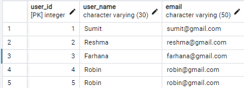
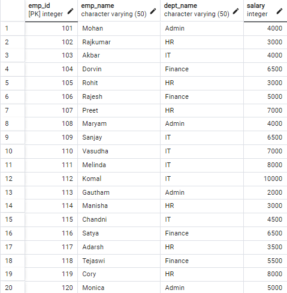

# SQL-PROJECT-1
This Project Introduces the Concept of Joins,Subquery,CTE(s),Windows Function,Coalesce while solving Real life Problems.

## INTRODUCTION
I solved some interview questions to improve my knowledge on Joins,Subquery,CTE(s),Windows Function,Coalesce. You'll be seeing my step by step approach in solving this Questions,I enjoy taking this Fruit🥑while solving this Questions 😄

### PROBLEM STATEMENT
 These questions aim at
- Writing a SQL query to fetch all the duplicate records from a table 
- Writing a SQL query to fetch the second last record from a employee table
- Writing a SQL query to display only the details of employees who either earn the highest salary or the lowest salary in each department from the employee table.

### DATA SOURCE
This Interview Questions and the Data used was gotten from techTFQ
you can access the questions via [link](https://www.youtube.com/watch?v=FNYdBLwZ6cE&t=1573s)

### DATA ANALYSIS
For This Project I created two Tables namely USERS TABLE and EMPLOYEE TABLE,
See table below

USERS          |    EMPLOYEE
:---:| :---:
 | 

CONCLUSION 
